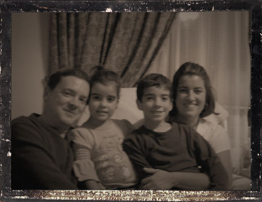
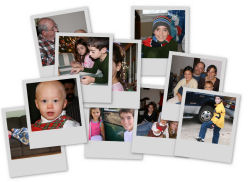

<!DOCTYPE html PUBLIC "-//W3C//DTD XHTML 1.0 Strict//EN"
               "http://www.w3.org/TR/xhtml1/DTD/xhtml1-strict.dtd">
<html xmlns="http://www.w3.org/1999/xhtml" xml:lang="en-gb" lang="en-gb">
<head>
<title>The Eash Family</title>
<meta http-equiv="Content-Type" content="text/html; charset=UTF-8" />
<meta http-equiv="imagetoolbar" content="false" />

<!--[if IE]>

<![endif]-->
<!--[if IE 6]>

<![endif]-->
<!--[if IE 5.5]>

<![endif]-->
</head>
<body id="topofpage" class="homepage">

<!-- <h1><a href="index.php" title="Link to home page.">http://eashweb.com/index.html</a></h1> -->
<h2><q>The Eash Family</q></h2>

This is the homepage for the 
<strong>Eash</strong> family:  

David, Janine 
Zack & Courtney 
and Alex

<a href="#content">Skip site navigation and move to main content of page.</a>

<ul id="nav-a">
<li id="nav-a-home"><a href="index.html" title="Home page">Home</a></li>
<!-- <li id="nav-a-gallery"><a href="galleries.html" title="Our latest photo albums">Gallery</a></li> -->
<li id="nav-a-alex"><a href="alex.html" title="In memory of Alex....">Alex</a></li>
<li id="nav-a-lego"><a href="lego.html" title="Our Lego Projects">Lego Projects</a></li>
</ul>

<h3>Introduction</h3>

We have finally settled on our new domain name of "EashWeb.com" and have begun updating our new homepage.  The first project has been to publish the pages for Alex's site.  The pages for Alex were originally posted to our first website in 1996.  For some time, we did not have anything active. 
Now, Alex's site is active once again, and updated content will follow as soon as we can. 
 
 
 
 

  

<!-- 
General notation content text....
 -->
<!-- 
Warning content text.....
  -->

<h3 id="sidesnips">Heading Level 3</h3>

<h2>See our photo site:</h2>

<a href="http://picasaweb.google.com/djazceash"> 
 
http://picasaweb.google.com/djazceash</a>

<h3 id="siteupdates">Heading Level 3</h3>

 
 <a href="http://www.j9designs4me.com">http://www.j9designs4me.com</a> 
 Janine's custom made creations,  come check them out !

<!-- 

<h3 id="coolsites">Heading Level 3</h3>

Snip Three...

 -->

<ul id="nav-b">
<li id="totop"><a href="#topofpage" title="Jump back to the top of the document.">Top</a></li>
</ul>

&copy; 2007 <a href="#" title="More information about the author.">David Eash</a>. All rights reserved.

</body>
</html>
